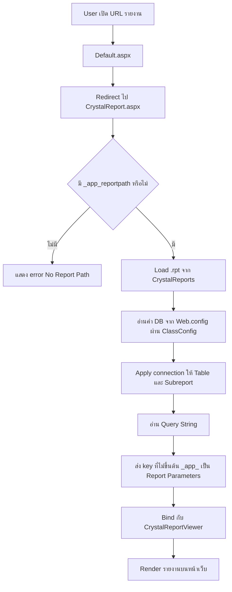
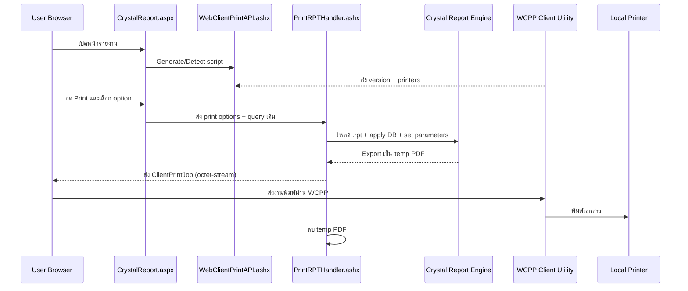

# OGA Report Manager

ระบบแสดงผลและพิมพ์รายงานคลังสินค้า (WMS) บน ASP.NET Web Forms โดยใช้ Crystal Reports เป็นแกนหลักของการ render report และมี WebClientPrint สำหรับสั่งพิมพ์ไปยังเครื่องพิมพ์ฝั่ง client

## 1) ภาพรวมโปรเจกต์

โปรเจกต์นี้คือเว็บแอปสำหรับเปิดรายงาน .rpt แบบ dynamic ผ่าน query string โดยสามารถ:

- เปิดรายงานจากไฟล์ในโฟลเดอร์ CrystalReports
- ส่งพารามิเตอร์เข้า report จาก query string
- ตั้งค่า database login ให้ report/subreport อัตโนมัติจาก Web.config
- แสดงผลผ่าน CrystalReportViewer
- พิมพ์ตรงไปเครื่องพิมพ์ฝั่งผู้ใช้งานด้วย Neodynamic WebClientPrint (WCPP)
- สร้าง Barcode/QR แบบ on-the-fly ผ่าน HTTP handler (barcodegen.ashx)

## 2) เทคโนโลยีและ dependency หลัก

- ASP.NET Web Forms (.NET Framework 4.6.1)
- Crystal Reports for .NET (13.0.3500.0)
- Microsoft ReportViewer WebForms 10.0.0.0
- Neodynamic.SDK.WebClientPrint 5.0.0
- Aspose.BarCode 16.11.0
- Frontend: Bootstrap 4.3.1, jQuery 3.4.1, Font Awesome 4.7.0, Popper.js

อ้างอิงจาก:

- WebReportHightJump/WebReportHightJump.csproj
- WebReportHightJump/packages.config

## 3) โครงสร้างไฟล์สำคัญ

- WebReportHightJump/Default.aspx.cs: redirect ไป CrystalReport.aspx
- WebReportHightJump/CrystalReport.aspx: UI report viewer + print modal + JavaScript integration กับ WCPP
- WebReportHightJump/CrystalReport.aspx.cs: load report, set DB connection, map query params เป็น report params
- WebReportHightJump/WebPrint/WebClientPrintAPI.ashx(.cs): endpoint bridge ระหว่าง browser กับ WCPP utility
- WebReportHightJump/WebPrint/PrintRPTHandler.ashx(.cs): สร้างไฟล์ PDF ชั่วคราวจาก report แล้วส่ง print job ให้ client
- WebReportHightJump/barcodegen.ashx.cs: สร้าง barcode/QR image จาก query string
- WebReportHightJump/ClassConfig.cs: อ่านค่าจาก appSettings เช่น crtServer, crtDatabase, crtZoomDefault
- WebReportHightJump/Web.config: ค่า appSettings, handlers, auth

## 4) การทำงานหลักของระบบ (Flow)

### 4.1 Report View Flow



### 4.2 Client Print Flow (WCPP)



## 5) Query string contract สำหรับเรียกรายงาน

พารามิเตอร์สำคัญ:

- \_app_reportpath (required): ชื่อไฟล์ .rpt ภายใต้โฟลเดอร์ CrystalReports
- \_app_Reporttitle (optional): title ที่แสดงบน master page
- key อื่นทั้งหมดที่ไม่ขึ้นต้น _app_: จะถูก map เป็น report parameter โดยใช้ชื่อ key ตรงกับ parameter ใน report

ตัวอย่าง:

```text
/CrystalReport.aspx?_app_reportpath=rptAging.rpt&_app_Reporttitle=Aging%20Report&WH=BK01&DocDate=2026-09-22
```

ในตัวอย่างด้านบน:

- WH และ DocDate จะถูกส่งเข้า report parameter
- \_app_reportpath ใช้กำหนดไฟล์รายงาน
- \_app_Reporttitle ใช้ตั้งหัวข้อบนหน้าเว็บ

## 6) Barcode endpoint

Endpoint:

- /barcodegen.ashx?symbology=QR&code=TEXT

symbology ที่รองรับในโค้ด:

- Code128
- Code39 / Code39Standard / Code39Extended
- Code93 / Code93Standard / Code93Extended
- EAN13
- EAN8
- Datamatrix
- QR

หมายเหตุ: handler จะคืนค่าเป็น binary image โดยตรง

## 7) วิธีรันในเครื่อง dev

Prerequisites:

- Windows + Visual Studio (รองรับ Web Forms/.NET Framework)
- .NET Framework Developer Pack 4.6.1
- Crystal Reports runtime/assemblies ที่ตรงกับเวอร์ชันในโปรเจกต์
- SQL Server ที่เข้าถึงฐานข้อมูลเป้าหมายได้

Steps:

1. เปิด WebReportHightJump.sln
2. Restore NuGet packages
3. ตรวจค่าใน WebReportHightJump/Web.config
   - crtServer
   - crtDatabase
   - crtUser
   - crtPass
   - crtZoomDefault
4. ตั้ง startup project เป็น WebReportHightJump
5. Run ด้วย IIS Express หรือ Local IIS
6. ทดสอบด้วย URL ที่มี \_app_reportpath และ report parameters

## 8) Configuration ที่ต้องระวัง

- โค้ดใช้งานค่าจาก appSettings ผ่าน ClassConfig โดยตรง
- การเชื่อม DB ถูก apply ทั้ง DataSourceConnections, Tables และ Subreports
- มีการตั้ง provider เป็น MSOLEDBSQL และเปิด Trust Server Certificate
- Print handler มีการสร้างไฟล์ PDF ชั่วคราวในโฟลเดอร์ CrystalReports แล้วลบทิ้งหลังส่งงาน

## 9) Known risks / ข้อควรปรับปรุง

- ข้อมูล credential ฐานข้อมูลอยู่ใน Web.config แบบ plain text
- URL parameter ยังไม่มีชั้น validation/whitelist สำหรับชื่อไฟล์ report และค่าพารามิเตอร์
- มีไฟล์สำรองและโฟลเดอร์ backup จำนวนมากใน repo (ควรแยกออกหรือ archive)
- การ parse parameter ฝั่ง PrintRPTHandler ยังอิงตำแหน่ง index ใน query (เริ่ม i >= 16) ซึ่งเปราะบาง

## 10) เอกสารอ้างอิงภายในโปรเจกต์

- WebReportHightJump/WebReportHightJump.csproj
- WebReportHightJump/CrystalReport.aspx
- WebReportHightJump/CrystalReport.aspx.cs
- WebReportHightJump/WebPrint/PrintRPTHandler.ashx.cs
- WebReportHightJump/WebPrint/WebClientPrintAPI.ashx.cs
- WebReportHightJump/barcodegen.ashx.cs
- WebReportHightJump/Web.config
